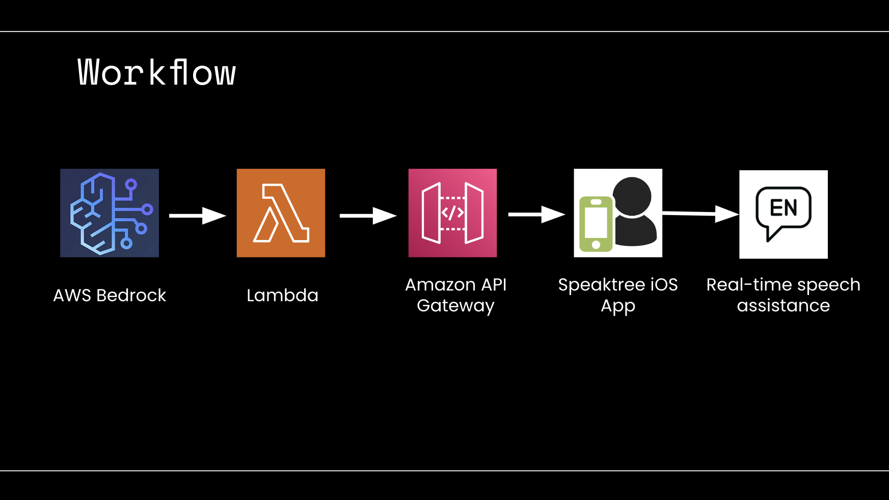

# Speaktree AI

demo video: https://youtu.be/cVlM5wfbrfc

## 💡 Inspiration
- Typically, AI applications assist users through a request/response fashion, where users ask a question, and the AI provides an answer. However, I wanted to create an experience where the **user becomes the AI**. 
- The idea for Speaktree AI was born from a desire to help people improve their public speaking and communication skills. I recognized that many individuals struggle with articulating their thoughts clearly and confidently. 
- With Speaktree AI, as you speak, the app prompts questions and provides real-time suggestions to help build and improve your responses dynamically, while gathering AI-driven analytics.

## 🚀 What it does
- As you speak, Speaktree provides real-time suggestions to help you build and improve your answers. 
- The app also offers detailed analytics on your speech, helping you refine your communication skills. 
- Powered by AWS Bedrock, Lambda, and API Gateway, Speaktree AI delivers an interactive and seamless experience on a native iOS Swift app.

## 🛠️ How I built it
- **Backend**: Utilized AWS Bedrock for the model and exposed an API endpoint using AWS Lambda and API Gateway. Also integrated OpenAI API. This allows the user to select from a host of models and select the one they like best.
- **Frontend**: Built the mobile app natively using Xcode, Swift, and SwiftUI, ensuring a seamless and responsive user interface. Integrated Face ID for authentication.

## 🏃 Challenges we ran into
- **Low-Latency Speech to Text**: Ensuring real-time speech processing was a challenge. Instead of using a speech to text API which was too slow, I utilized the SF Speech Recognizer (iOS native), which processes speech on-device quickly and efficiently. This significantly improved the app's ability to provide real-time suggestions without lag.

## 🎉 Accomplishments that I'm proud of
- **Fast Model Querying to Support Real-Time Assistance**: One of the biggest challenges was ensuring the app could process speech and provide suggestions in real-time without lag. We solved this by implementing dynamic model selection (**efficient using bedrock**), allowing users to choose the most suitable model based on the contents of their conversation, as different language models excel at different tasks. This ensures quick and relevant feedback tailored to the user's needs.

## 📚 What I learned
- Throughout the development of Speaktree AI, I realized that different language models excel at different tasks. This understanding was crucial in designing the app to leverage the strengths of various models effectively. Additionally, I discovered the **power of AWS Bedrock** and ecosystem in enabling efficient utilization of these different models within the app.

## 🔮 What's next for Speaktree AI: Real-time Speech Enhancement
- **Audio Suggestions**: Provide real-time suggestions via audio so users don’t have to read while speaking, helping them build confidence during in-person meetings and presentations.
- **Gamified Learning**: Introduce a more game-like mode with scores and levels to make learning engaging and fun, encouraging users to improve their speaking skills through challenges and rewards.
- **Empathy Detection**: Integrate empathy detection to provide users with more specific insights on their tone and emotional delivery, helping them communicate more effectively and empathetically.
- **Progress Tracking**: Persist users' previous conversations and measure their improvement over time, providing detailed progress reports and personalized recommendations for further development.
